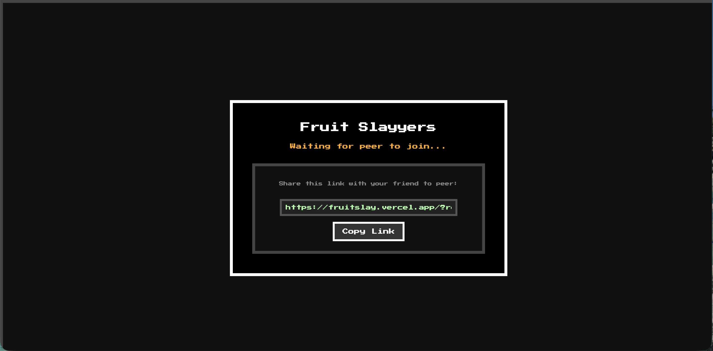
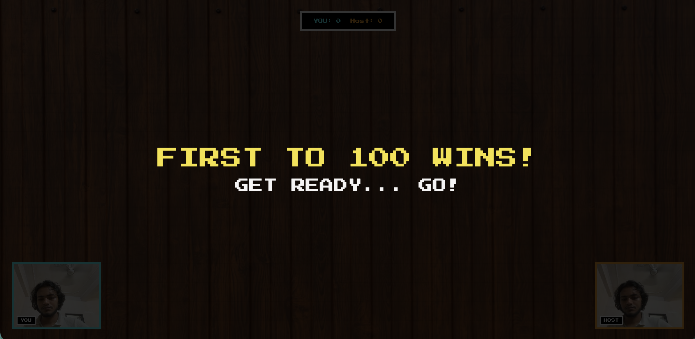

# fruit slayyers

a fruit ninja clone you play with your actual hand, in your browser, with up to 4 friends at once. no controller, no mouse, no download. just your webcam and your finger.

this is my project for #horizons.

**play it here:** [fruitslay.vercel.app](https://fruitslay.vercel.app/)

---

## why i made this

i was scrolling through x and kept seeing people build these small fun little browser projects, and it got me itchy to build something myself. i'd already messed around with mediapipe before on a project called [youblinkyoulose](https://youblinkyoulose.netlify.app) (a game where you lose if you blink lol), so i knew i wanted to play with hand/face tracking again.

but this time i wanted to push it further, i wanted it multiplayer. not just "track your hand and play alone" but actual peer to peer, video-chatting-while-you-slice-fruit, up to 4 people at once kind of multiplayer. so that's what this is.

## what it actually is

fruit slayyers is a browser game where:

- you hold your hand up in front of your webcam
- your index finger becomes your sword/blade
- fruit (and bombs, watch out) get launched up on screen
- you swipe your finger through them to slice them
- first person to 100 points wins
- bombs mess up your score if you hit them, so don't get greedy

you can play solo-ish to test it, but the actual point is playing with friends. one person hosts, gets a link, sends it to friends, they join straight from the browser. up to 4 players in one match, each with their own webcam bubble on screen and their own score.

## how it works (the fun technical bit)

- **hand tracking**: using google's mediapipe hands model, running entirely in your browser. it reads your webcam feed frame by frame, finds your hand, and grabs the tip of your index finger as the "blade" position. no server ever sees your camera feed for this part, it's all happening locally on your device.

- **slicing detection**: every time your fingertip moves, the game checks the path it just travelled and sees if that path crossed any fruit. if it did, sliced. speed of your swipe also triggers a little swoosh sound because why not.

- **multiplayer**: this is all peer-to-peer using webrtc (via peerjs), meaning there's no game server sitting in the middle. the host's browser literally becomes the "server" for that match. it spawns the fruit, keeps score, and syncs the game state to everyone else's browser directly. when you join a friend's game, your browser connects straight to theirs.

- **video chat**: while you play, everyone's webcam shows up in a little box in the corner (fighting-game style), also streamed peer-to-peer through webrtc. so you can see your friends flailing their hands around while getting destroyed at the game.

- **slots and colors**: up to 4 players get assigned a slot (and a color) when they join, host is always slot 0. scoreboard updates live for everyone.

## tech stack

- html, css, canvas for the actual game rendering
- vanilla javascript for all the game logic (fruit physics, slicing, scoring, game state)
- [mediapipe hands](https://developers.google.com/mediapipe) for in-browser hand tracking
- [peerjs](https://peerjs.com/) (built on webrtc) for peer-to-peer multiplayer + video calls, no backend server needed
- pixel/arcade font because it just felt right for a fruit slicing game

## how to play

1. open the link, allow camera + mic access
2. if you're hosting: you'll get a share link, copy it and send it to up to 3 friends
3. if you're joining: just open the link your friend sent you
4. hold your hand up so the camera can see it
5. swipe your index finger through the fruit as it flies up
6. avoid the bombs
7. first to 100 points wins, loser buys the next round of snacks (rule not enforced by the code, just vibes)

## screenshots

**the "copy link" screen you get when you host a game:**

**the "first to 100 wins" / winner screen:**

**two people playing:**

**four people playing at once, full chaos mode:**

## ai usage, being real about it

used ai a bit here and there, not gonna pretend i didn't. mainly for:
- initial structuring of the project when i was starting out
- designing the fallback fruit drawings (the canvas-drawn shapes used when an image asset fails to load)
- some minor debugging near the end

that's it. honestly less than 10% of this, definitely not more than 20%. most of the actual game logic, the hand tracking integration, the p2p/webrtc syncing, the physics, the slicing detection, all of that was me grinding through it myself.

this whole thing took me about 13 hours spread across days. if i'd just let ai build it end to end it probably would've been an hour of work, but that defeats the point of actually building something and learning from it.

## notes / things worth knowing

- everything is peer-to-peer, so game performance depends a bit on everyone's internet connection, not a central server
- hand tracking runs locally in your browser, your webcam feed for tracking purposes never leaves your device
- built and iterated on over a few days, starting from a basic single player slicer and working up to full 4-player p2p + video